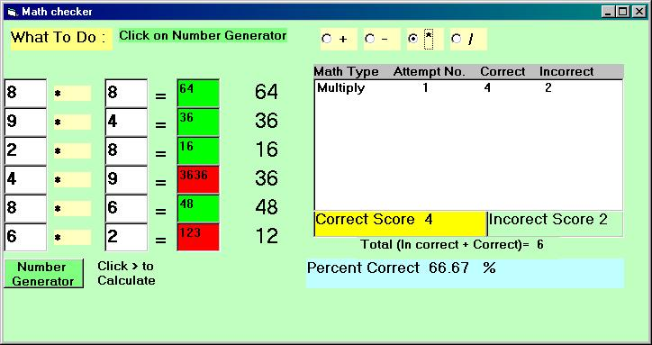



## Math Check

### Description

I created this application for my son in second grade. We can choose math type and generate numbers at random matching to text boxes. I used arrays. You can alter the range of numbers for the youngsters in the house.
 
### More Info
 
Use of Rnd function, arrays,

             |
---                |---
**Submitted On**   |2001-01-17 17:13:34
**By**             |[Manas Mukherjee](https://github.com/Planet-Source-Code/PSCIndex/blob/master/ByAuthor/manas-mukherjee.md)
**Level**          |Intermediate
**User Rating**    |4.8 (38 globes from 8 users)
**Compatibility**  |VB 6\.0
**Category**       |[Complete Applications](https://github.com/Planet-Source-Code/PSCIndex/blob/master/ByCategory/complete-applications__1-27.md)
**World**          |[Visual Basic](https://github.com/Planet-Source-Code/PSCIndex/blob/master/ByWorld/visual-basic.md)
**Archive File**   |[CODE\_UPLOAD138741182001\.zip](https://github.com/Planet-Source-Code/manas-mukherjee-math-check__1-14493/archive/master.zip)

